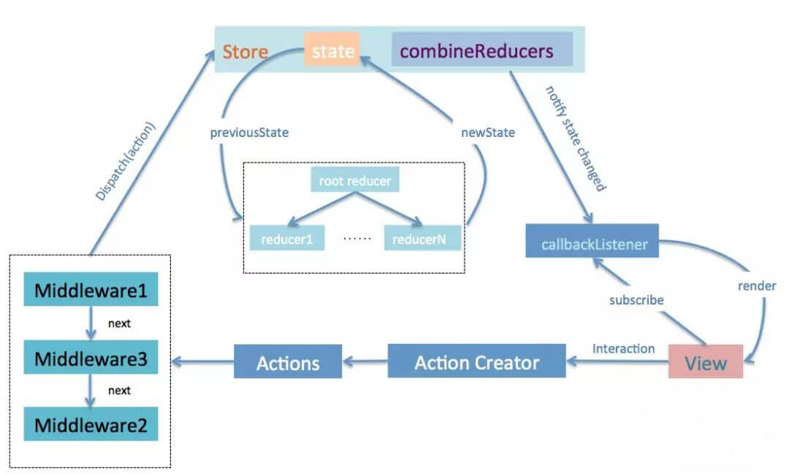

## Redux

### 为什么要用Redux  
  
1. react 中数据单向流动，非父子组件通信相对麻烦，redux就是为了解决跨组件state数据问题  
2. UI 层级比较复杂，有较多交互场景时

**应用场景**  
1. 用户操作较为繁琐，导致组件间依赖关系复杂。如，通过多筛选组件控制其它组件功能  
2. 权限较多且有不同的使用方式，如管管理层、普通层等  
3. 数据交互较多，请求实时性要求较高需要保持鲜活度  
4. 缓存数据较多，记录用户对表单的提交前操作、分页控制等  

### 数据流向
  

dispatch(action) -> reducer -> subscribe -> view   

### redux 应用的三大原则
1. 单一数据原则 - 全局store下进行统一配置
2. state只读 - 必须通过 action 来改变state，触发更新，直接修改state无效
3. reducer 必须是纯函数 - 通过 state 和 action 计算出新 state 


### applyMiddleware 实现

```js
export default function applyMiddleware (...middlewares) {
    return (next) => (reducer, initialState) => {
        var store = next(reducer, initialState);
        var dispatch = store.dispatch;
        var chain =[];
        var middlewareAPI = {
            getState: store.getState, 
            dispatch:(action)=>dispatch(action)
        };
        chain = middlewares.map(middleware =>middleware(middlewareAPI)); 
        dispatch = compose(...chain, store.dispatch);
        return {
            ...store,
            dispatch
        };
    };
}
```


#### redux-thunk  
redux中间件-主要处理异步问题  

优点： 库小，代码就几行  
缺点：代码臃肿，reducer不再是纯粹函数，直接返回对象，违背了当初的设计原则  

```js
function createThunkMiddleware(extraArgument) {
  return ({ dispatch, getState }) => (next) => (action) => {
    if (typeof action === 'function') {
      return action(dispatch, getState, extraArgument);
    }

    return next(action);
  };
}

const thunk = createThunkMiddleware();
thunk.withExtraArgument = createThunkMiddleware;

export default thunk;
```

#### redux-saga
异步操作——>Effect函数——>纯文本对象——>saga-middleware——>执行异步操作  
优点：
  -  将异步与reducer区分开了，更加优雅，适合大量APi请求，而且每个请求之间存在复杂
  -  集中处理了所有的异步操作，异步接口部分一目了然  
  -  action是普通对象，这跟redux同步的action一模一样  
  -  通过Effect，方便异步接口的测试  
  -  通过worker 和 watcher 可以实现非阻塞异步调用，并且同时可以实现非阻塞调用下的事件监听  
  -  异步操作的流程是可以控制的，可以随时取消相应的异步操作。    
  
缺点：复杂度高，学习成本较高